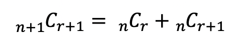

# 이항 계수 (binomial coefficient)
> 주어진 집합에서 원하는 개수만큼 순서없이 뽑는 조합의 개수

- 이항 : 한 개의 아이템을 뽑거나, 뽑지 않거나 2가지 선택지가 있다는 의미

- 11051번 문제 : 주의할 점
  - k = 0 일 때, nCk의 값은 항상 1이다.
  - n = k 일 때, nCk의 값은 항상 1이다.

- 파스칼 삼각형을 이용한 조합의 성질
  
  
