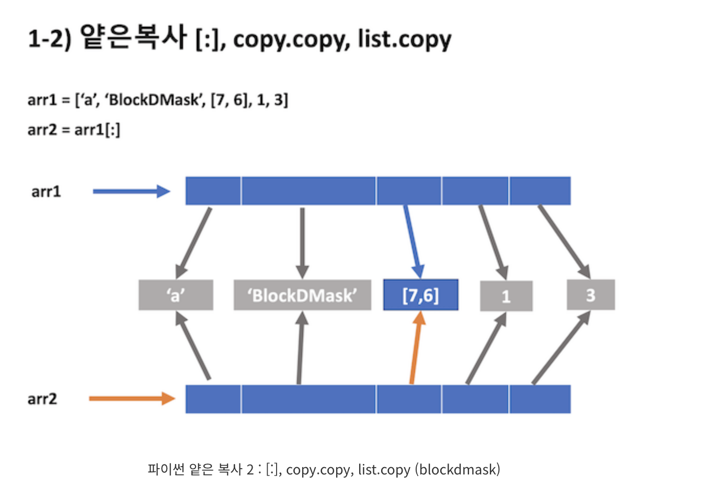
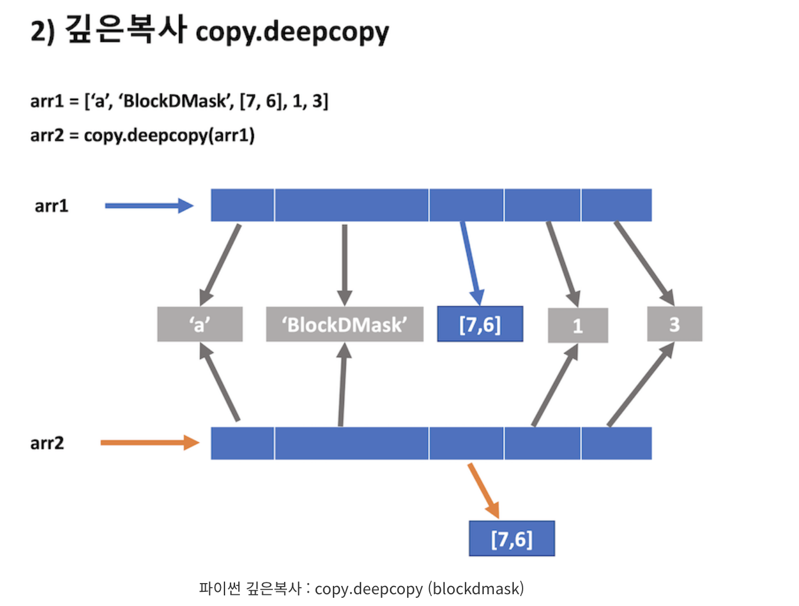

# 깊은 복사와 얕은 복사
BOJ 14502번 연구소 문제를 푸는데 계에에속 시간초과 발생..

코드를 살펴보니 deepcopy()를 너무 남발하여 발생한 문제 같았다. (그래도 deepcopy가 아니면 해결할 방법이 없는거 같은데ㅠ_ㅠ)

이참에 얕은 복사와 깊은 복사를 정확하게 짚고 넘어가면 좋을 것 같아서 정리하게 되었다!

- 참고 : [mutable 🆚 immutable](https://blockdmask.tistory.com/570), [얕은복사, 깊은복사](https://blockdmask.tistory.com/576)

### 목차
1. [객체의 특징 : mutable 🆚 immutable](#1-객체의-특징--mutable-vs-immutable)
2. [얕은 복사 - Shallow Copy](#2-얕은-복사---Shallow-Copy)
3. [깊은 복사 - Deep Copy](#3-깊은-복사---Deep-Copy)
4. [언제 뭘 사용하면 좋을까?](#4-언제-뭘-사용하면-좋을까)

## 1. 객체의 특징 : mutable vs immutable
파이썬에서 변수는 자신에게 할당된 객체를 가리키는 포인터와 같다.

변수는 자체 저장 공간을 할당 받지 않으며, 자신에게 할당된 객체를 가리킨다.

### mutable 객체

:상태가 **변경**되는 객체

변수에 다른 변수 할당 시, **객체의 주소값**을 복사한다.

mutable 객체의 값은 메모리에 각각 할당된다.

- 종류
  - list
  - set
  - dict : key-value 매핑

### immutable 객체

:상태가 **변경되지 않는** 객체

변수에 다른 변수 할당 시, 해당 **값**을 복사한다.

immutable 객체의 값은 동일한 값에 참조가 여러개 붙는다.
- 종류
  - bool
  - int
  - float
  - str
  - tuple : immutable한 순서가 있는 객체 집합
  - frozenset : immutable한 set

## 2. 얕은 복사 - Shallow Copy
### 얕은 복사
:같은 곳을 참조하고 있는 것
- 복사했다고 생각하지만,, 사실은 메모리 주소만 복사한 것이다. (실제 객체를 복사한 것 X)
- immutable한 객체는 값을 변경하면 **항상 참조가 변경**되므로 얕은 복사하던 깊은 복사하던 상관 X
  
  어떤 복사를 해도 참조하던 다른 객체의 값도 변경되지 않는다.

### 얕은 복사 하는 법
1. `=` : 대입 연산자  `arr2 = arr1`
2. **`[:]` : 슬라이싱**   `arr2 = arr1[:]`
   - `arr1 = arr2[:]` 일 때 arr1과 arr2는 다른 메모리 주소를 갖는다.
      
     → 그래서 arr2 리스트를 변경 (값을 추가) 하면 arr1에 적용되지 X
   - arr **리스트 내부 리스트**들 끼리는 같은 주소를 참조하고 있어서, 이 리스트를 변경하면 전체에 반영된다.
   - 완전히 깊은 복사도 얕은 복사도 아니다. but 얕은 복사로 취급함.
3. 객체의 `copy()` 메서드  `arr2 = arr1.copy()`
   - `[:]` 과 동일한 결과
4. copy 모듈의 `copy()` 메서드  `arr2 = copy.copy(arr1)`
   - `[:]` 과 동일한 결과

## 3. 깊은 복사 - Deep Copy
### 깊은 복사
- 모든 것을 새롭게 복사. 독립적인 객체를 하나 더 많드는 작업
- 리스트 내부 리스트, 딕셔너리 내부 리스트 등 내부에 있는 객체 모두 새롭게 만들어주는 작업

### 깊은 복사 하는 법
1. copy 모듈의 `deepcopy()` 메서드 : 똑같이 생긴 별개의 객체를 새롭게 생성  `copy.deepcopy(arr)`

## 4. 언제 뭘 사용하면 좋을까?
- immutable 객체 → 얕은 복사ㄱㄱ

- mutable 객체 
  - 리스트/딕셔너리/집합 내부의 리스트/딕셔너리/집합을 변경 해야 하면 **깊은 복사** 
    
    arr2의 수정사항이 arr1에 영향을 주면 안되는 경우 깊은 복사를 해야한다.
  - 리스트/딕셔너리/집합 내부의 정수(immutable 객체)를 변경해야 하면 **얕은 복사**
    
    깊은 복사는 메모리(공간) 뿐만 아니라 시간적인 비용도 많이 지불해야 한다.

## 질문 
Q. 그럼 리스트를 추가만 할 때에는 얕은 복사를 해도 됨? **YES!**

Q. arr2 리스트의 immutable 요소 (int)를 변경할 때에는 어떻게 될까? 
arr1의 immutable 값은 변하지 않는다.
[예제코드](copy_test.py)

### 🚨 BOJ 14502번 - 연구소
< BOJ 14502번 - 연구소 > 에서 얕은 배열을 써서 시간 초과 문제를 해결하려 하였지만 원본 리스트가 유지되지 않아 불가능했다.

왜냐하면, 해당 문제는 **2차원 배열**을 수정한다. **리스트 내부의 리스트(mutable)**!!!

따라서 원본을 유지하고 싶다면 **깊은 복사**를 해야한다. 

