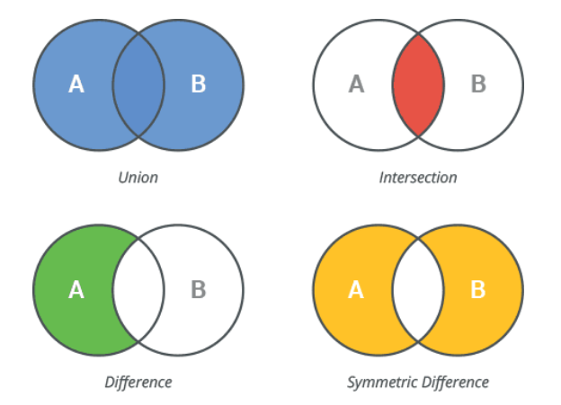

# 파이썬 자료형 정리
## 목차
1. [리스트 자료형 :list](#1-리스트-자료형--list)
2. [집합 자료형 : set](#2-집합-자료형--set)
3. [딕셔너리 자료형 : dictionary](#3-딕셔너리-자료형--dictionary)
4. [튜플 자료형 : tuple](#4-튜플-자료형--tuple)

## 1. 리스트 자료형 : list
**배열 🆚 리스트** 
- **array (배열)**
  - 메모리 상에 데이터가 연속적으로 저장된다. → 메모리 낭비
  - 같은 성질을 갖는 항목들의 집합
  - 고정된 크기를 갖는다. (한번 크기를 지정하면 변경 불가능)
  - 삽입, 삭제 시 O(N)의 시간 복잡도를 갖는다.
  - 원소에 접근 시 O(1)의 시간 복잡도를 갖는다.
- **list (리스트)**
  - 메모리 상에 데이터가 비연속적으로 저장된다. → 메모리 낭비가 없다.
  - 크기가 가변적이다.
  - 리스트에 저장되는 원소가 모두 같은 타입일 필요가 없다.
  - 삽입(append), 삭제(pop), 조회(arr[i]) 시 O(1)의 시간 복잡도를 갖는다.
  - 삭제(del, remove), min, max, iteration, list comperhension, in, 리스트 전체 비교 시 O(N)의 시간 복잡도를 갖는다.
  - 삽입, 삭제, 크기 등 리스트를 사용하기 위한 다양한 속성과 메서드가 존재한다.
  - 리스트 안에 리스트 중첩이 가능하다.

### 리스트 초기화 방법
1. `[[0] * n] * m` 
- integer multiplication : 리스트를 복제하여 초기화하는 방식
- 모든 행이 동일한 리스트 객체를 참조하고 있다. → 한 행을 바꾸면 모든 행에 적용된다.
- 메모리 사용량이 적다.
- 배열 안에 배열들을 선언하는 것이 아니라 각각의 배열을 선언한다.

2. `[[0 for _ in range(n)] for _ in range(m)]`
- list comprehension 
- 각각의 행이 별도의 리스트 객체를 참조하고 있다. → 하나의 리스트가 변경되어도 다른 리스트는 영향을 받지 않는다.
- 메모리 사용량이 더 많다.
- 배열 안에 2차원 배열을 선언한다.

### 리스트 정렬 방법
- 1차원 리스트 오름차순 정렬 : `list.sort()`
- 1차원 리스트 내림차순 정렬 : `list.sort(reverse=True)`
- key를 이용한 정렬 : `list.sort(key = len)`
- 2차원 리스트 정렬 : `list.sort(key = lambda x:(x[0], -x[1]))` - 1열 기준 오름차순 → 2열 기준 내림차순 

### 리스트 요소 추가, 조회, 삭제
**추가**
- append : 리스트에 요소 추가
- insert : 지정한 인덱스에 요소 삽입 (뒤의 인덱스들은 한칸씩 밀림) `list.insert({인덱스}, {값})`

**조회**
- index : 특정 값이 몇 번째 인덱스에 있는지 반환받기 `list.index({값})`
- count : 특정 값이 1차원 리스트 안에 몇 개인지 반환받기 `list.count({값})`
- max : 1차원 리스트 최댓값 조회 `max(list)`
- min : 1차원 리스트 최솟값 조회 `min(list)`
- sum : 1차원 리스트 요소들의 총합 계산 `sum(list)`
- len : 리스트의 전체 요소 개수 조회 `len(list)`
- in : 특정 값이 1차원 리스트에 존재하는지 조회 `{값} in list`

**삭제**
- remove : 리스트에서 삭제하려는 값 중 처음으로 찾은 1개만 삭제  `list.remove({값})`
- clear : 리스트 비우기 (모든 요소 삭제)  `list.clear()` 
- del : 인덱스 값을 지정하여 삭제  `del list[{인덱스}]` 

  인덱스 범위를 지정하여 부분 삭제  `del list[1:4]` - list[1], list[2], list[4] 삭제
- pop : 리스트 맨 뒤의 요소를 삭제  `list.pop()`
  
  지정한 인덱스의 인덱스의 값을 삭제 후 반환받기  `list.pop({인덱스})` 
  

## 2. 집합 자료형 : set
- ex) s = {1, 2, 3, 4}
- 중복을 허용하지 않는다. → 중복을 제거하기 위한 필터로도 자주 사용된다.
- 순서가 없다. → 인덱스로 접근하고 싶다면 set을 list나 tuple로 변환한 후 가능하다. `arr = list(s)`
- 슬라이싱과 인덱싱이 불가능하다 & 개별 요소에 접근할 수 없다. → 특정 요소만 출력할 수 없다.
- 교집합, 합집합, 차집합, 대칭 차집합을 구할 때 용이하다.
    
    

### 집합 초기화 방법
1. 가변 집합 생성 : `s = set()`
   - `s = set([1, 2, 3])`처럼 초기화해줄 수 있다.
   - `s = {1, 2, 3}` 으로 초기화할 수도 있다.
   - `s = {}` 와 같이 만들면 빈 딕셔너리가 만들어진다. 주의!!!
   - 집합 안에 집합을 넣을 수 없다. ~~`{{1, 2}, {3, 4}}`~~

2. 불변 집합 생성 : `s = frozenset({iterable한 객체})`
   - `add()` 로 요소를 추가하려 하면 AttributeError가 발생한다.
   - 불변 집합 안에 불변 집합을 넣을 수 있다. (가변 집합은 넣을 수 없다) `frozenset(frozenset([1, 2]), frozenset([3, 4]))`

### 집합 요소 추가, 조회, 삭제
**추가**
- add : 1개의 값만 추가 `s.add({값})`
- update : 여러 개의 값을 한번에 추가 `s.update({iterable한 객체})`
  - iterable한 객체 : list, tuple, set, dictionary 등

**조회**
- len : 집합 요소 개수 세기 `len(s)`
- in : 특정 값이 집합에 존재하는지 조회 `{값} in s`

**삭제**
- remove : 1개의 값만 제거 `s.removce({값})`

  원소가 없으면 keyError 발생
- discard : 여러 개의 값을 한번에 제거. 만약 set에 존재하지 않는 값을 제거하려고 하면 아무런 작업도 수행하지 않는다. `s.discard({iterable한 data type})`
- pop : 임의의 요소 1개를 제거하고 제거한 값 반환 `s.pop()`
  
  python3.7 이상부턴 pop() 이 항상 **가장 작은 원소를 제거** 후 반환한다.
- clear : 집합의 모든 요소 제거 `s.clear()`

**집합에만 있는 특별한 연산들**

조회 관련 
- intersection : 교집합 `s1 & s2` , `s1.intersection(s2)`
- union : 합집합 `s1 | s2` , `s1.union(s2)`
- difference : 차집합 `s1 - s2` , `s1.difference(s2)` 
- symmetric_difference : 대칭 차집합 `s1 ^ s2` , `s1.symmetric_difference(s2)`
- issubset : s1이 s2의 부분 집합이면 true 반환 (s1 ⊆ s2) `s1.issubset(s2)`
- issuperset : s2가 s1를 포함하면 true 반환 (s1 ⊂ s2) `s2.issuperset(s1)`
- isdisjoint : s1과 s2의 교집합이 있으면 false 반환 `s1.isdisjoint(s2)`

갱신 관련
- intersection_update : s1을 s1과 s2의 교집합으로 갱신 (s1 = s1 ⋂ s2) `s1.intersection_update(s2)`
- difference_update : s1을 s1과 s2의 차집합으로 갱신 (s1 = s1 - s2) `s1.difference_update(s2)`
- symmetric_difference_update : s1을 s1과 s2의 대칭 차집합으로 갱신 (s1 = (s1 ⋃ s2) - (s1 ⋂ s2)) `s1.symmetric_difference_update(s2)`

### list 🆚 set 시간복잡도
- list : `x in list`  **O(n)**
- set, dict : `x in set` **O(1)**
   
  이유 : 파이썬의 set이 [hash table](./hashtable.md)로 구현되어 있기 때문이다.

→ in 값으로 탐색하고자 한다면 list를 set으로 변환한 후 in 연산을 사용하는 것이 좋다

<details>
<summary>BOJ_1987 오답노트</summary>
<div markdown="1">

### 1. 시간 복잡도를 고려하여 list에서 set으로!

- 참고 : [파이썬 기본 연산자들의 시간복잡도](https://m.blog.naver.com/PostView.nhn?blogId=complusblog&logNo=221204308911&proxyReferer=https:%2F%2Fwww.google.com%2F)

처음에 past를 list 로 선언하였다.
- `dfs()` 내부에서 past에 요소를 추가할 때 `past.append({값})` 연산 수행 → **O(1)**
- `dfs()` 내부에서 재귀 호출 후 요소를 제거할 때 `del past[-1]` 연산 수행 → **O(n)**

시간 초과 발생 후 past의 자료형을 list에서 set 으로 변경
- `dfs()` 내부에서 past에 요소를 추가할 때 `past.add({값})` 연산 수행 → **O(1)**
- `dfs()` 내부에서 재귀 호출 후 요소를 제거할 때 `past.remove({값})` 연산 수행 → **O(1)**

### 2. Python3 가 아닌 PyPy3로 제출
Pypy3는 Python3에 비해 속도가 조금 빠르지만 재귀에 약하다는 특징 때문에 재귀를 사용한 문제에서는 항상 Python3로 제출하였다.

가끔 Pypy3로 제출을 하면 어김없이 메모리 초과가 발생하였는데, 
```python
sys.setrecursion(10**5) //pypy3에서는 정답, python3에서는 recursionError
sys.setrecursion(10**6) //pypy3에서는 메모리초과, python3에서는 정답
```
[몸소 겪었던 Python과 PyPy의 차이(메모리,속도)](https://imksh.com/46) 해당 블로그를 통해 둘의 차이와 정확한 이유를 알 수 있었다. 
</div>
</details>

## 3. 딕셔너리 자료형 : dictionary

## 4. 튜플 자료형 : tuple