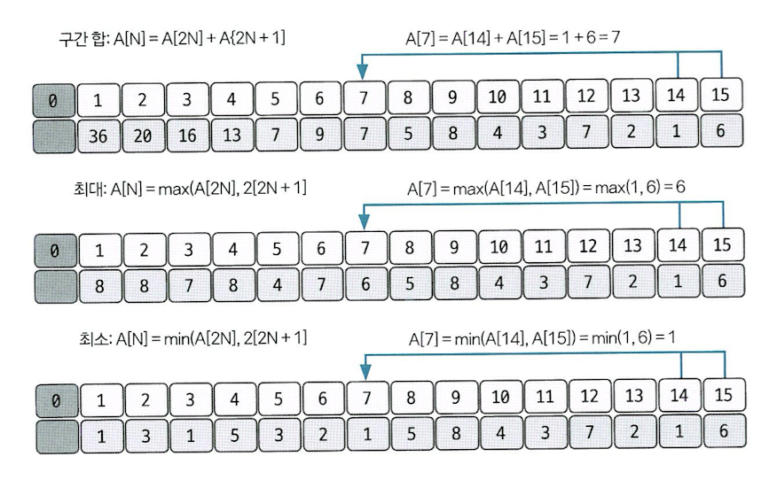
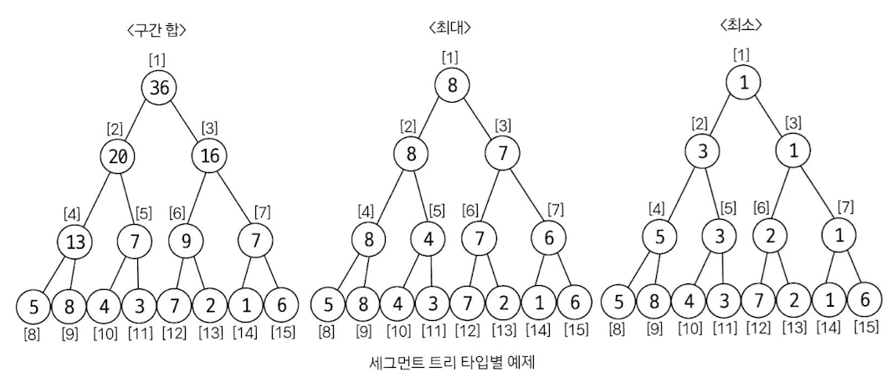

# 세그먼트 트리
- 구간합/곱, 구간의 최댓값/최솟값을 구할 때 유용하다.
- 구간합의 경우 prefix sum 방식을 사용해도 되지만, 이는 업데이트가 느리다는 단점이 있다.
  
    세그먼트 트리는 이 단점을 보완해준다.

## 1. 세그먼트 트리 (인덱스 트리) 초기화하기
- 이진 트리 (한 노드의 자식은 2개)
- 원본 데이터는 트리의 리프 노드에만 들어간다. (그 위 부분은 조건에 맞게 업데이트 할 예정)
- 우리는 인덱스 트리를 1차원 배열로 나타낼 예정

- **트리의 크기 정하기**
  - 원본 데이터가 n개 일 때, $2^k >= n$을 만족하는 k의 최솟값을 구한 후, **$2^k * 2$** 를 트리 배열의 크기로 정의하면 된다.
  - 이유 : 원본 데이터가 리프 노드에 모두 들어가야 하기 때문에 리프노드는 최소 $2^k$개 있어야 한다. 
  - 이 때, 원본 데이터가 처음 들어가는 인덱스는 **$2^k$** 가 된다.

## 2. 부모 노드 채우기 (세그먼트 트리에서 연산하기)
### 2-1. 구간합
- 처음에 internal node를 모두 `0` 으로 초기화한다.
- 합을 구하고자 하는 구간의 마지막 인덱스부터 idx=1까지 반복문을 돌며 부모 노드에 자신의 값을 더한다.
- 아래의 예제 코드처럼 트리의 맨 마지막부터 idx=1 까지 연산을 진행하면, `seg[1]` 에는 원본 데이터 전체의 합이 저장된다.
```python
  seg = [0]*2**4
  # ~1번 설명처럼 리프노드를 원본 데이터로 초기화하는 과정~
  end= 2**4
  for idx in range(end, 0, -1):
      seg[idx//2] += seg[idx]
```

### 2-2. 구간의 최댓값
- 처음에 internal node를 모두 `-float('inf')` (음의 무한대)로 초기화한다.
- 트리의 맨 마지막 인덱스부터 원본 데이터가 시작하는 부분까지 반복문을 돌며 부모 노드의 값과 자신의 값을 비교하며 더 큰 값만 남긴다.
- 
```python
  seg = [0]*2**4
  # ~1번 설명처럼 리프노드를 원본 데이터로 초기화하는 과정~
  end= 2**4
  for idx in range(end, 0, -1):
      seg[idx//2] = max(seg[idx//2], seg[idx])
```

### 2-3. 구간의 최솟값
- 처음에 internal node를 모두 `float('inf')` (양의 무한대)로 초기화한다.
- 트리의 맨 마지막 인덱스부터 원본 데이터가 시작하는 부분까지 반복문을 돌며 부모 노드의 값과 자신의 값을 비교하며 더 작은 값만 남긴다.

```python
  seg = [0]*2**4
  # ~1번 설명처럼 리프노드를 원본 데이터로 초기화하는 과정~
  end= 2**4
  for idx in range(end, 0, -1):
      seg[idx//2] = min(seg[idx//2], seg[idx])
```




## 3. 질의값 구하기
1. 주어진 질의 인덱스(범위)를 세그먼트 트리의 리프 노드에 해당하는 인덱스로 변경한다.

```python
  n = int(input())      # 원본 데이터의 개수를 의미함 (2**k>=n)
  start, end = map(int, input().split())    # 시작 인덱스, 끝 인덱스의 범위 입력받기
  start += 2**k -1
  end += 2**k -1
```
2. `start % 2 == 1` 일 때, 해당 노드를 선택한다.
3. `end % 2 == 0` 일 때, 해당 노드를 선택한다.
4. `start = (start+1)//2` 연산을 실행한다.
5. `end = (end+1)//2` 연산을 실행한다.
6. 2~5번을 반복하다가 `end < start` 가 되면 종료한다.

- 구간합을 구하는 경우
```python
    ans = 0
    while start <= end:
        if start % 2 == 1:
            ans += seg[start]       # 독립 노드, 따로 처리하기
            start += 1
        if end % 2 == 0:
            ans += seg[end]         # 독립 노드, 따로 처리하기
            end -= 1
        start = start // 2
        end = end // 2
```

- 최댓값을 구하는 경우
```python
    ans = -float('inf')
    while start <= end:
        if start % 2 == 1:
            ans = max(ans, seg[start])      # 독립 노드, 따로 처리하기
            start += 1
        if end % 2 == 0:
            ans = max(ans, seg[end])        # 독립 노드, 따로 처리하기
            end -= 1
        start = start // 2
        end = end // 2
```

## 4. 데이터가 업데이트 될 때
- 구간합의 경우
  - 5번째 원본데이터가 변경된 경우, 인덱스 트리에서 해당 노드의 부모 노드만 업데이트 하면 된다.

    (prefix sum 방식에서는 5번째 원본 데이터가 없데이트 되면 idx = 5 부터 end 까지의 모든 값을 업데이트 해야했음.`O(n)` / 세그먼트 트리 방식이 훨씬 효율적임 `O(logn)`)
  - 만약 구간합을 구하는 문제에서 원본 데이터가 업데이트 되지 않을 때에는 굳이 세그먼트 트리를 사용할 필요가 없다. 그 때에는 prefix sum ㄱㄱ!


> 출처
> - [Do it! 알고리즘 코딩 테스트](https://m.yes24.com/Goods/Detail/111686187)
> - [알고리즘 코딩테스트 핵심이론 강의 - 세그먼트트리(인덱스 트리)](https://www.youtube.com/watch?v=1d9sqmuLy-o&t=1067s)